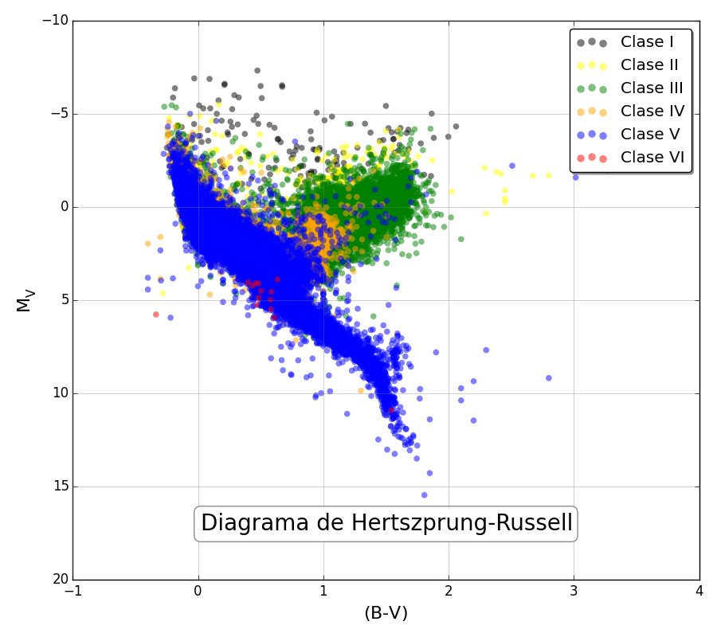

HR Diagram constructed from XHIP data
=================================

The Extended Hipparcos Compilation (XHIP1) is a dataset of all stars based on the *Hipparcos, the New Reduction of the Raw Data*2, which largely improved the astrometry over the original Hipparcos3 catalog.

1. Anderson, E., & Francis, C. 2012, AstL, 38, 331
2. van Leeuwen F. 2007, A&A, 474, 653
3. ESA 1997, The Hipparcos and Tycho Catalogs, ESA-SP 1200

In order to run the Python script to generate the HR diagram below, the following packages are required:

* [NumPy](http://www.numpy.org)
* [Matplotlib](http://matplotlib.org)
* [Astropy](http://astropy.org)
* [Astroquery](https://pypi.python.org/pypi/astroquery)

The script also prints the number of stars per luminosity class:

| Lc   |  Num    |
| ----:| -------:|
| I    | 234.0   |
| II   | 873.0   |
| III  | 12022.0 |
| IV   | 5447.0  |
| V    | 23988.0 |
| VI   | 14.0    |

and per spectral type:

| SpT |  Num    |
| ---:| -------:|
| O   | 22.0    |
| B   | 3495.0  |
| A   | 6766.0  |
| F   | 11961.0 |
| G   | 9399.0  |
| K   | 9613.0  |
| M   | 1309.0  |
